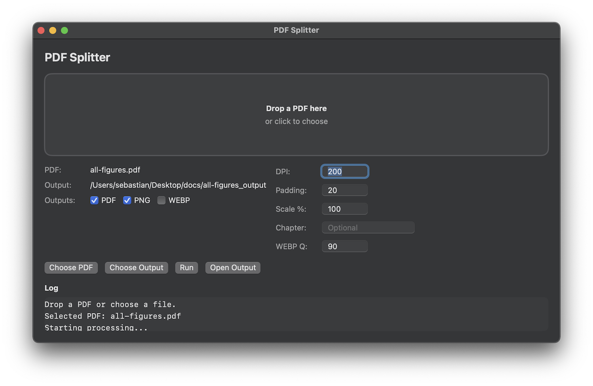
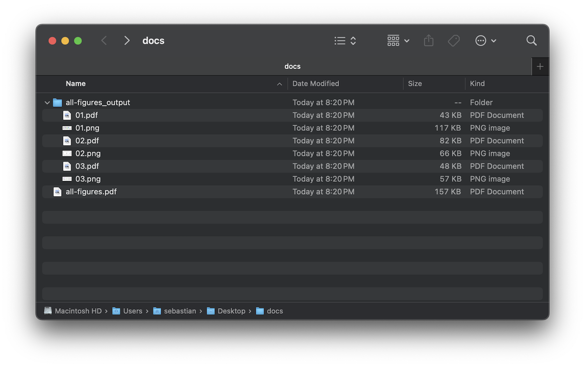

&nbsp;
# PDF Splitter (macOS)

Native macOS app to split a PDF into per-page PDFs and export per-page images. It supports PNG and WEBP, with cropping, padding, DPI control, and optional scaling.

PNG rendering defaults to Poppler (`pdftocairo`/`pdftoppm`) for sharper output; you can disable it in the UI to use PDFKit instead. Install Poppler with `brew install poppler` if needed.

WEBP quality is adjustable, and WEBP export can fall back to `cwebp` if ImageIO does not support it.

Below is a screenshot of the interface.

And the following screenshot shows a list of the generated files.

&nbsp;

Try it yourself using the [docs/all-figures.pdf](docs/all-figures.pdf) demo PDF.

&nbsp;

## Download and use app

Download and open [PDF.Splitter.dmg](https://github.com/rasbt/macos-pdf-splitter/releases/download/v1.0/PDF.Splitter.dmg), which contains the `PDF Splitter.app`.

&nbsp;
## Build and run

Alternatively, build the App locally yourself:

- Open `PDFSplitterMacApp.xcodeproj` in Xcode.
- Select the `PDFSplitterMacApp` scheme and run (`⌘R`).

&nbsp;
## Export a .app bundle from Xcode

- In Xcode, choose Product → Build (or `⌘B`).
- Then choose Product → Show Build Folder.
- Open `Products/Debug/` (or `Release/`) to find `PDF Splitter.app`.
